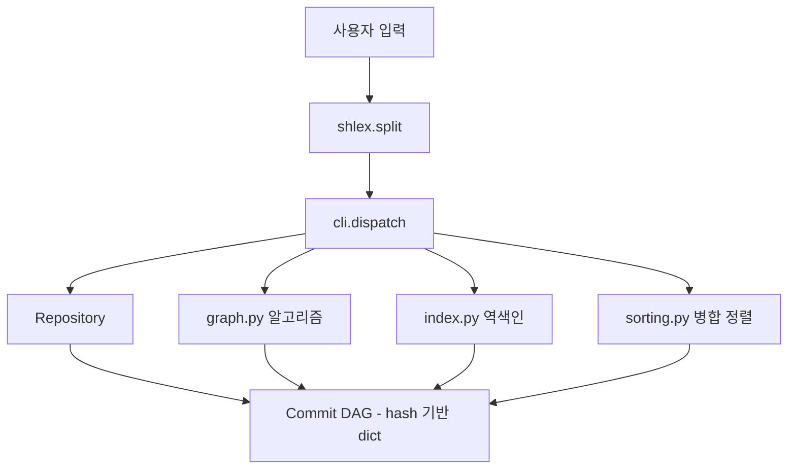

# Mini Git 구술 평가 대비 문서

이 문서는 제출용이 아니라 나 자신을 위한 대본이다. "왜 이렇게 짰냐"고
물어봤을 때 코드를 다시 읽으며 더듬거리지 않으려고 쓴다.

## 전체 아키텍처



`cli.py`는 컨트롤러다. 파싱하고, `Repository`를 호출하고, 결과 문자열을
받아 출력한다. 실제 "머리 쓰는" 로직은 전부 `graph.py`, `sorting.py`,
`index.py`에 있고 `Repository`는 상태(브랜치/HEAD/커밋 저장소)만 들고
있다. 계층을 나눈 이유는 단순하다 — `PATH`를 고치다가 실수로 `COMMIT`
로직을 건드리는 사고를 막고 싶었다.

---

## 1. 커밋 그래프는 왜 DAG인가

`Commit`은 `parents: list[str]` 필드 하나로 그래프를 표현한다.

```python
class Commit:
    def __init__(self, commit_hash, message, author, timestamp, parents, order):
        self.parents = parents  # 0개 이상의 부모 해시
```

- **방향성(Directed)**: 간선은 항상 "자식 → 부모" 한 방향이다. 자식은
  부모를 가리키지만, 부모는 (커밋 시점에는 존재하지도 않았던) 자식을
  가리킬 수 없다.
- **비순환(Acyclic)**: `COMMIT`은 오직 "현재 HEAD를 부모로 하는 새 커밋"만
  만든다. 새 노드는 항상 기존 노드를 가리키므로, 이미 있는 커밋을 다시
  가리키는 간선이 생길 방법이 구조적으로 없다 — 사이클을 만들려면 미래의
  커밋을 지금 가리켜야 하는데 그런 커밋은 아직 해시조차 없다.

실제로 만들어보면:

```
mini-git> init "Alice"
mini-git> commit "Initial commit"        # 006077, parents=[]
mini-git> branch feature
mini-git> switch feature
mini-git> commit "Add login feature"     # c01cec, parents=[006077]
mini-git> switch main
mini-git> commit "Add payment feature"   # cf127b, parents=[006077]
```

`006077`은 부모가 하나도 없는 루트 커밋, `c01cec`과 `cf127b`은 같은 부모
`006077`을 공유하는 두 자식이다. 트리처럼 보이지만 "여러 부모를 가질 수
있다"는 조건(merge commit)까지 포함하면 트리가 아니라 일반 DAG다 — 지금
구현은 `COMMIT`이 부모를 하나만 만들기 때문에 우연히 트리 모양일 뿐,
`graph.shortest_path`는 두 부모를 가진 다이아몬드 구조에서도 정확히
동작하도록 짰다 (`test_mini_git.py`의 `test_shortest_path_lexicographic_tiebreak`
가 그 증거다).

저장소 자체는 `dict[hash, Commit]`이라 조회는 O(1)이고, 해시는
`sha1(순번:salt:message:timestamp)`의 앞 6자리라서 충돌해도 salt를 올려
재시도하면 되니 유일성이 항상 보장된다.

---

## 2. "부모가 먼저 출력되는 로그" — 위상 정렬

`LOG`(정렬 옵션 없이)를 최신순으로 그냥 나열하면 안 되는 이유: 자식이
부모보다 먼저 보이면 "이 커밋이 어디서 갈라져 나왔는지" 읽는 사람이
거꾸로 추적해야 한다. 그래서 Kahn 알고리즘(진입차수 기반 BFS)을 썼다.

```python
def topological_order(commits_by_hash):
    children = {...}   # 부모 -> 자식 목록 (역방향 인접리스트)
    indegree = {...}    # 각 커밋의 부모 개수

    ready = [부모가 0개인 커밋들, 생성 순서로 정렬]
    while ready:
        h = ready.pop(0)
        order.append(h)
        for child in children[h]:
            indegree[child] -= 1
            if indegree[child] == 0:
                ready.append(child)
```

부모 수(진입차수)가 0인 커밋만 먼저 꺼내고, 하나 꺼낼 때마다 그 커밋을
부모로 둔 자식들의 진입차수를 1씩 깎는다. 자식의 진입차수가 0이 되는
순간은 "그 자식의 부모가 전부 이미 출력됐다"는 뜻이므로 그때 큐에
넣는다 — 그래서 결과 순서에서 부모는 항상 자식보다 앞에 나온다.

재미있는 포인트 하나: 이 구현에서는 "커밋 생성 시점에 부모가 이미
존재해야 한다"는 제약 때문에, **생성 순서 자체가 이미 위상 정렬 결과와
같다.** 그래서 사실 `topological_order` 없이 그냥 생성 순서(`order`
필드)로 나열해도 결과는 똑같다. 그런데도 진짜 Kahn 알고리즘을 넣은
이유는, 나중에 과거 이력을 통째로 가져오는(import) 기능이 생기면 그
가정이 깨지기 때문이다 — 그런 경우에도 안전하게 동작하는 걸 원해서
지름길을 택하지 않았다.

`LOG --sort-by=date|author`는 위상 정렬이 아니라 `sorting.merge_sort`로
타임스탬프/작성자 기준 정렬한다. 이건 "순서 요구사항"이 아니라 "그룹핑
요구사항"이라 위상 정렬과는 다른 문제다.

---

## 3. 최단 경로와 조상 탐색

### PATH — 무방향 BFS + 그리디 사전순 재구성

문제를 두 단계로 나눴다.

1. **거리 계산**: 부모-자식 간선을 무방향으로 보고, 도착점에서부터 BFS를
   한 번 돌려 모든 노드의 "도착점까지 남은 거리"를 구한다.
2. **경로 재구성**: 출발점에서 시작해서, 매 걸음마다 "도착점까지 거리가
   1 줄어드는 이웃들" 중 해시가 가장 작은 것을 고른다.

```python
candidates = merge_sort(adjacency[current], key=lambda h: h)
for neighbor in candidates:
    if dist_to_end.get(neighbor) == dist_to_end[current] - 1:
        next_hop = neighbor
        break
```

왜 이게 "사전순으로 가장 작은 최단 경로"가 되는가: 모든 최단 경로는
길이(노드 개수)가 같다. 길이가 같은 문자열들을 비교하면 첫 글자, 그다음
글자... 순서로 비교하는 것과, 경로의 첫 번째 노드, 두 번째 노드...를
비교하는 것이 결과적으로 같다. 그러니 매 위치에서 "최단 거리를 유지하는
후보 중 가장 작은 해시"를 고르는 그리디가 곧 전체 문자열을 사전순으로
최소화하는 것과 같다. 전체 경로를 다 나열하고 문자열로 비교해서 고르는
것보다 훨씬 싸다(O(V+E) vs 경로 개수만큼의 문자열 비교).

`test_mini_git.py`의 다이아몬드 테스트가 이걸 확인한다: `a0`에서 `b1`과
`c1`로 갈라졌다가 `d2`에서 다시 만나는 그래프에서, `a0`→`d2` 최단 경로
후보가 `a0->b1->d2`와 `a0->c1->d2` 두 개일 때 `'b1' < 'c1'`이므로
`a0->b1->d2`가 선택되는 걸 검증했다.

### ANCESTORS — 단순 DFS

```python
stack = list(commits_by_hash[start_hash].parents)
while stack:
    h = stack.pop()
    if h in seen: continue
    seen.add(h)
    stack.extend(commits_by_hash[h].parents)
```

부모 포인터만 따라가면 되니 BFS든 DFS든 상관없다(최단 경로가 필요한
게 아니라 "도달 가능한 전부"가 필요하니까). 방문한 노드를 `seen`에
기록해서 다이아몬드 구조에서 같은 조상을 두 번 세지 않도록 했다.

---

## 4. 정렬 알고리즘 직접 구현 — 병합 정렬

`sorted()`/`list.sort()` 금지 조건이 있어서 병합 정렬을 짰다.

```python
def merge_sort(items, key):
    if len(items) <= 1: return list(items)
    mid = len(items) // 2
    left = merge_sort(items[:mid], key)
    right = merge_sort(items[mid:], key)
    return _merge(left, right, key)
```

- **시간복잡도**: 평균도 O(n log n), 최악도 O(n log n)이다. 입력을 절반씩
  쪼개는 과정(log n번)마다 병합에 O(n)이 걸리기 때문에 입력이 어떻게
  생겼든 항상 같다. 퀵 정렬을 안 쓴 이유가 이거다 — 퀵 정렬은 평균은
  O(n log n)이지만 이미 정렬된 입력 같은 최악의 경우 O(n²)로 무너진다.
- **안정 정렬(stable) 여부**: 안정적이다. `_merge`에서 동점 비교를 `<=`로
  처리해서, 왼쪽(원래 앞쪽에 있던) 원소를 항상 먼저 넣는다.

  ```python
  if key(left[i]) <= key(right[j]):
      merged.append(left[i]); i += 1
  ```

  이게 왜 중요하냐면, `LOG --sort-by=author`에서 같은 작성자의 커밋이
  여러 개면 원래 생성 순서(오래된 것 → 최신)를 그대로 유지해야
  자연스럽다. 만약 `<`로 바꾸면(동점일 때 오른쪽을 먼저 넣으면)
  같은 작성자 커밋들의 순서가 뒤집힐 수 있다 — `test_mini_git.py`의
  `test_merge_sort_is_correct_and_stable`이 `key`가 같은 세 원소가
  입력 순서(`x, y, z`)를 유지하는지 검증한다.

---

## 5. 역색인 — 왜 순회보다 빠른가

`SEARCH`를 순진하게 짜면 매번 모든 커밋의 메시지를 훑어야 한다
(O(전체 커밋 수 × 메시지 길이)). 커밋이 쌓일수록 검색 한 번이
점점 느려진다.

```python
class InvertedIndex:
    def add(self, commit):
        for token in commit.message.lower().split():
            self.by_keyword.setdefault(token, []).append(commit.hash)
        self.by_author.setdefault(commit.author, []).append(commit.hash)
```

핵심 아이디어는 "훑는 작업을 검색 시점이 아니라 커밋 시점으로 옮긴다"는
것이다. `COMMIT`이 일어날 때마다 메시지를 토큰화해서
`keyword -> [hash, ...]`, `author -> [hash, ...]` 두 딕셔너리를 갱신해
둔다. 그러면 `SEARCH login`은 그냥 `by_keyword["login"]`을 꺼내는
딕셔너리 조회 한 번, 즉 O(1) 조회 + O(결과 개수)로 끝난다.

전체 커밋이 N개, 검색 결과가 K개라고 하면: 순회 검색은 검색 1회당
O(N), 역색인은 O(1) 조회 + O(K)다. 대신 그만큼 "쓰기 비용"을 커밋
시점으로 옮긴 것뿐이다 — 공짜는 아니고, "검색은 자주 하고 커밋은
상대적으로 덜 한다"는 가정(로그 서비스, 코드 검색 등 실제 Git
워크플로우와 잘 맞는 가정) 위에서 이득을 보는 트레이드오프다.

---

## 코드 구조에 대한 자기 평가

**잘한 점**

- 알고리즘 3종(정렬/그래프/인덱스)을 각각 독립 모듈로 분리해서, `PATH`
  버그를 고치다가 `SEARCH`를 건드릴 일이 없다.
- `graph.shortest_path`가 처음부터 "부모 2개(merge commit)"를 가정하고
  짜여 있어서, 보너스 과제인 `MERGE` 명령을 나중에 추가해도 이 함수는
  손댈 필요가 없다.
- REPL 파싱을 직접 정규식으로 짜지 않고 표준 라이브러리 `shlex`에
  맡겼다 — 따옴표/이스케이프 처리를 재발명하지 않은 것.

**한계 / 더 할 수 있는 것**

- BFS 큐(`_bfs_distances`, `topological_order`의 `ready`)는 `list.pop(0)`
  대신 인덱스 포인터(`i += 1`)로 앞을 "가리키기만" 해서 매 스텝 O(1)로
  처리했다 — `collections.deque`를 새로 끌어올 필요 없이 표준 list로도
  충분했다.
- 역색인이 메모리에만 있어서 프로세스를 껐다 켜면 다시 만들어야 한다.
  요구사항이 "데이터 영속성 불필요"라서 의도적으로 그대로 뒀다.
